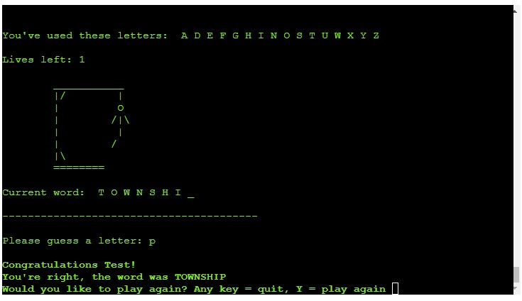

# Hangman Game - Python

This hangman game is a Python terminal game deployed on Heroku. 
The aim of this game is for the player to have fun trying to guess a random word of a varying length. 

The game can help keep the mind sharp. By guessing letters and critically thinking of letter patterns and the most common letters in the English language.
The players win the game if they guess the word correctly in the allotted number of guesses, otherwise it's a game over.

After each incorrect guess, the construction of the gallows begins, while one life is lost and the hanging figure increases.

At the beginning of the game, the player is asked to give its name, which is then used to wish them luck and, at the end of the game, congratulate them on winning or give condolences on its loss.

Once the game is finished, the player is asked if it'd like to play again. 
Entering 'Y' will restart the game with a new random word. 
Entering in anything other than 'Y' ('N' or another character) will conclude the game.

## Game FlowChart

When planning the game, I thought about what commands and what user input would be needed for the game to work. To aid in development, I created this flowchart using [Lucid](https://lucid.app/documents#/dashboard) to help visualize the final game flow.

## How to play

First the player chooses a nickname and a random word. 
The player will then guess one letter at a time. 
If the letter is part of the word, it will appear in lieu of one of the blank spaces ( _ ). 
If the letter is not in the word, a life will be lost and a part of the gallows or a body part of the figure will appear each time the letter is wrong.

The player continues guessing until they complete the word correctly, winning the game, or until all lives are lost and they are hung, signifying their loss. 
For either outcome, an end of game message will appear incorporating the name the player entered at the beginning. 
The players will then have the opportunity to play again if they choose, with a different random word.

## Features

* Green and red colors were included for aesthetic purposes and as a way to guide the player.

* To begin, the player is greeted with a welcome message, the instructions of the game and they're asked for their name.

* A random word is generated for the player to guess. The word is shown as a set of underscores symbolizing each letter. The underscore characters are shown as letters when the player guesses a correct letter.

* If the player makes an incorrect guess they are told the letter is not part of the word, a life is lost and the gallows and hanging figure are built piece by piece (letter by letter). The number of lives remains unchanged if the player guesses a correct letter.

* An error message shown for: duplicate guesses, numbers or special characters (invalid letters), or two letters / characters guessed at the same time.

* When the game is over, the players are either congratulated or given condolences by name.

## Testing

- Tested for all scenarios with invalid guesses (numbers, special characters, double characters).
- Tested for all scenarios with successful guesses (valid letters only).
- This game was only tested in Chrome, Safari and Firefox browsers on a Macbook Pro laptop device. The app worked well in all browsers.

## PEP8 validation (IDE: PyCharm)

I installed and run pep8 on my IDE by following this documentation: [Pep8](https://pypi.org/project/pep8/).

During testing, I have been suggested inside my terminal to install [pycodestyle](https://pypi.org/project/pycodestyle/), also formally called pep8.
It actually helped me to visualized all the warnings in my code.

Before running the tests I had these errors in my terminal: 

.

All errors and warnings were fixed, barring a few warnings for 'invalid escape sequence'. These do not affect the functionality of the game.
I eventually, spaced them out in a new line and that solved the issue.

## Points of improvement

- The final letter of the game is not currently shown in the 'Current word:', rather it's highlighted as part of the congratulatory message just under the player's final (correct) guess. Aesthetically, it would be best to have both the word completely written out in the game board and written as congratulations below. Missing Letter

- I could add a different level of the game based on a user input and changing the number of lives accordingly.

- As I mentioned in the 'Testing' section, this application was only tested on laptop devices in various browsers, which was done deliberately. The app is not responsive nor functions on a mobile phone. Since this app is a backend application working through a terminal, I chose to focus on functionality in the terminal. 
This could however be a point of improvement in the future as it would be fun to be able to play the game on a mobile phone.

## Bugs

To my knowledge, there are no major or unfixed bugs. 
The game run and does what it is supposed to do.

## Deployment to Heroku

This project was deployed on Heroku in the following manner:

1. Log into the [Heroku website](https://www.heroku.com)

2. Click 'New' and choose 'Create new app'. 

3. Choose an app name (this does NOT have to be identical to GitHub) and a region.

4. Click 'Create app'.

5. You should be on the 'Deploy' tab (1).

6. Choose connect to GitHub account (2).

7. Search for the repository you want to deploy. The name needs to match exactly (3).

8. Click 'Connect' (4).

9. Select whether you want automatic deployment.

10. Choose which branch you want to deploy. 

11. Click 'Deploy branch'

12. When the deployment is complete, go to the 'Settings' page to configure vars and buildpacks. 

13. Click 'Reveal Config Vars'. For this project, we needed PORT 8000 (as a var) and the Node.js and Python buildpacks.

14. Click 'Add' to fill out PORT and 8000 in he KEY / VALUE pair. This has been done.

15. Click 'Add buildpack' and select Node.js from the options.

### To Fork the Repository

To make a copy or ‘fork’ the repository

- Log into GitHub and locate repository
- On the right hand side of the page select the ‘fork’ option to create and copy of the original

### To create a Local Clone

1. under the repository name, click on the ‘code’ tab
2. in the clone box, HTTPS tab, click on the clipboard icon
3. in your IDE open GitBash
4. Changed the current working directory to the location you want the cloned directory to be made
5. Type ‘git clone’ and then paste the URL copied from GitHub
6. press enter and the local clone will be created

---
## Credits

- I used the Code Institute Python template for this project.

- I used a YouTube tutorial by [Kite](https://www.youtube.com/c/KiteHQ) for general background knowledge and used his list of words in the words.py file.

- For timed space between printed statements I imported sleep() from time, which I found through a Google search.

- To incorporate colors, I used a class found through a Google search.

- Though it was unnecessary to import outside libraries for this project, I did import a couple of libraries that were already part of the Python program: random, string and sleep, which were used to randomize words, link letters of the alphabet, and delay printed messages, respectively. 
I also created two files: words.py and hangedman.py. The former is a list of words (taken from Kite tutorial mentioned above).

- Feedback and comments from the reviewer of my portfolio project number 1 were taken into account for this project when running tests and identifying and fixing bugs.

### Acknowledgements
This website was executed and completed as a portfolio 2 Project for the full stack diploma at [Code Institute](https://codeinstitute.net/).

Sebastiano Ballotta, 2022.
